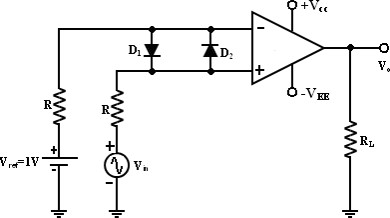
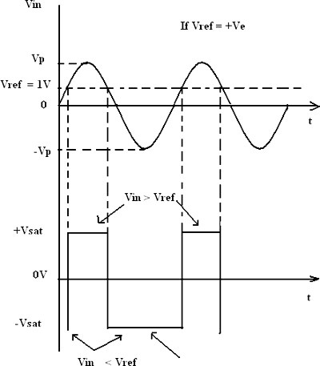
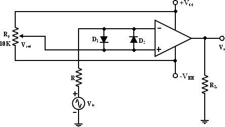
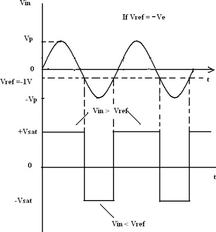

<h2>Introduction</h2>

A comparator as its name implies, compares a signal voltage on one input of an op-amp with a known voltage called a reference voltage on the other input. Comparators are used in circuits such as digital interfacing, schmitt trigger, discriminator voltage level detector and oscillators. A comparator circuit is basically an operational amplifier without feedback, that is, the op-amp is used in its open-loop configuration, and when the input voltage, Vin exceeds a preset reference voltage, Vref, the output changes state. Due to the very high open-loop gain of the operational amplifier, using it with positive feedback or even with no feedback at all causes the output to saturate to its supply rail producing one of two distinct output voltages depending on the relative values of its two inputs. 

### Non-Inverting Comparator

A fixed reference voltage Vref of 1 V is applied to the inverting input and time varying signal voltage Vin is applied to the non-inverting input as shown in figure 1. When Vin is less than Vref the output voltage V0 = –Vsat, and when Vin is greater than Vref, then V0 = +Vsat.   Thus the V0 changes from one saturation level to another. 

 

<b>Fig 1: Non-Inverting Comparator</b>
 
The diodes D1 and D2 protect the op-amp from damage due to the excessive input voltage Vin. Because of these diodes, the difference input voltage Vid of the op-amp diodes are called clamp diodes. The resistance R in series with Vin is used to limit the current through D1 and D2. To reduce offset problems, a resistance Rcomp = R is connected between the inverting input and Vref. The input and output waveforms are given figure 2.  
<b>Input and Output Waveforms</b>  

 

<b>Fig 2: Input and Output Waveforms of Non-Inverting Comparator</b>

### Inverting Comparator

An inverting comparator in which the reference voltage Vref is applied to the non-inverting input and Vin is applied to the inverting input as shown in figure 3. In this circuit Vref is obtained by using a10K potentiometer that forms a voltage divider with DC supply of +Vcc and the wiper connected to the input. As the wiper is moved towards +Vcc, Vref becomes more positive. Thus a Vref of a desired amplitude and polarity can be obtained by simply adjusting the 10K potentiometer. 

 

<b>Fig 3: Inverting Comparator</b>
 
The input and output waveforms of an inverting comparator are shown in figure 4.  
<b>Input and Output Waveforms</b>  

 

<b>Fig 4: Input and Output Waveforms of Inverting Comparator</b>
 

### Applications of Comparators

#### 1) Null detectors

A null detector identifies when a given value is zero. Comparators are ideal for null detection comparison measurements, since they are equivalent to a very high gain amplifier with well-balanced inputs and controlled output limits. The null detector circuit compares two input voltages: an unknown voltage and a reference voltage, usually referred to as vu and vr.

#### 2) Zero-crossing detectors

For this type of detector, a comparator detects each time an ac pulse changes polarity. The output of the comparator changes state each time the pulse changes its polarity, that is the output is HI (high) for a positive pulse and LO (low) for a negative pulse squares the input signal.

#### 3) Relaxation oscillator

A comparator can be used to build a relaxation oscillator. It uses both positive and negative feedback. The positive feedback is a Schmitt trigger configuration. Alone, the trigger is a bistable multivibrator. However, the slow negative feedback added to the trigger by the RC circuit causes the circuit to oscillate automatically. That is, the addition of the RC circuit turns the hysteretic bistable multivibrator into an astable multivibrator.

#### 4) Window detectors

Comparators can also be used as window detectors. In a window detector, a comparator is used to compare two voltages and determine whether a given input voltage is under voltage or over voltage.
