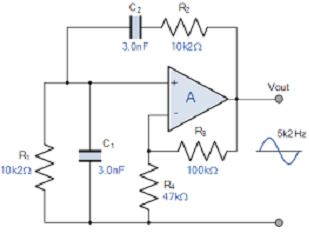

### Introduction
 

It is the commonly used audio frequency oscillator which employs both positive and negative feedback. The feedback signal is connected in the non-inverting input terminal so that the amplifier is working in non-inverting mode. The Wien bridge circuit is connected between amplifier input terminal and output terminal. The bridge has a series RC network in one arm and a parallel RC network in the adjoining arm. In the remaining two arms of the bridge, resistor R1 and Rf are connected. The phase angle criterion for oscillation is that the total phase shift around the circuit must be zero. This condition occurs when bridge is balanced. At resonance, the frequency of oscillation is exactly the resonance frequency of balanced Wien bridge and is given by 

<b> fo = 1/ (2πRC)</b>
 

At this frequency, the gain required for sustained oscillation is 3.It is provided by the non-inverting amplifier with  

<b>Gain = 1+ (Rf/R1) = 3</b>
 
                       

 

<b>Figure 1. Wein bridge oscillator using operational Amplifier</b>

  

### Effect of variation of resistance and capacitance on frequency 
The frequency of the oscillator varies with the variation in capacitance. It is inversely proportional to the capacitance. In other words, the frequency decreases with the increase in capacitance and vice versa. The variation in resistance has a similar effect on the frequency of the oscillator. 
                       

